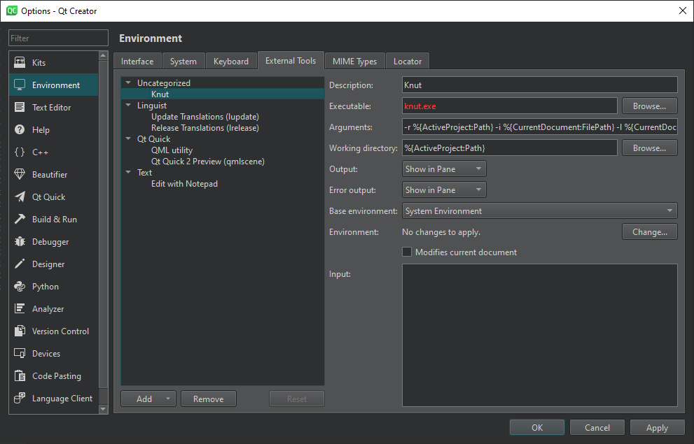

# Command Line Interface

## Using command line options

You can start knut by passing directly some options to the command line, using it in a headless way:
```
knut [option] [project]
```

The `project` is the directory containing the source code you want to work on. All available options are documented here:

| Options | Description |
|-|-|
|-r, --run `<file>` | Runs given script `<file>` then exit|
|-i, --input `<file>` | Opens document `<file>` on startup|
|-l, --line `<line>` | Sets the line in the current file, if any|
|-c, --column `<column>` | Sets the column in the current file, if any|
|--gui | Opens Knut user interface|
|--gui-run | Opens the run script dialog|
|--gui-settings | Opens the settings dialog|

Without any options, knut will start the user interface.

## IDE integration

Using the command line interface, one can integrate with existing IDE.

### Qt Creator

To add knut to Qt Creator, go to the menu `Tools`>`External`>`Configure...`, create a new tool, and fill the different fields for a new tool.



Particularly:

- in Arguments, you can use different variables, like:
    - `--root %{ActiveProject:NativePath}`
    - `--input %{CurrentDocument:FilePath}`
    - `--line %{CurrentDocument:Row}`
    - `--column %{CurrentDocument:Column}`
- in Workding directory: `%{ActiveProject:NativePath}`

For example, to open the knut user interface using the same project and same file as Qt Creator, you will pass in Arguments:
```
--gui --root %{ActiveProject:NativePath} --input %{CurrentDocument:FilePath} --line %{CurrentDocument:Row} --column %{CurrentDocument:Column}
```
