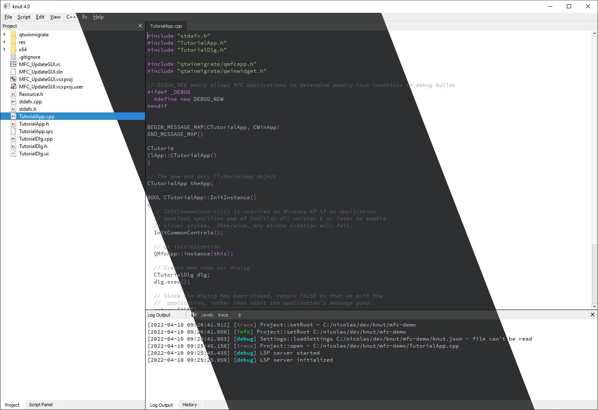
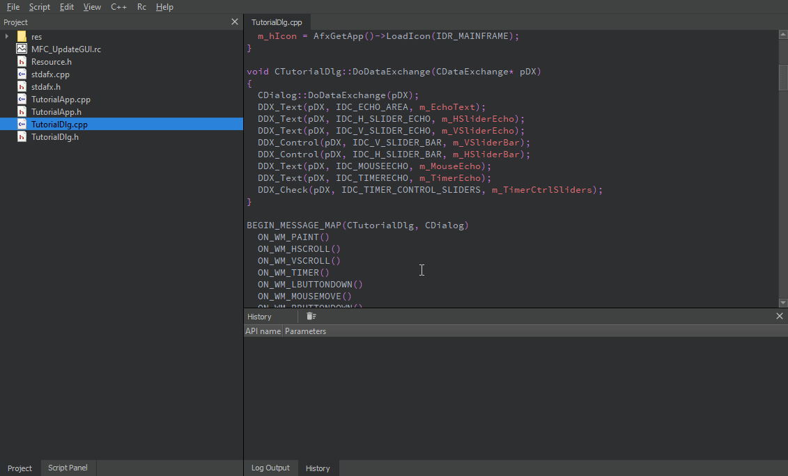

# User Interface

## Overview

The knut user interface is not an IDE, but rather a way to do some manual or automated transformation of the code.

Options are available via the `File`>`Options...` (or `Ctrl+,`), and allows you to change the look of the appliction, as well as some settings (see [Overview](overview.md)).

Beyond the central part, which is used to display the current document, you have 4 panels:

1. Project panel: files in the current project
2. Script panel: open/edit/run a script
3. Log output: display the logs from teh application, you can change the level
4. History panel: history of all user actions, can be used to create a script

## Palette

Like other existing editors, knut has a palette available using the `File`>`Show Palette...` (or `Ctrl+P`).

The palette allows you to:
- open a file from the project
- go to a line in the current document (`:` prefix)
- go to a specific symbol in the current docyment (`@` prefix)
- run a script (`.` prefix)

## Prototyping a script

Knut user interface allows you to prototype and experiment scripts easily. There are 2 different ways to do that.

### Record a script

You can record and play a script using the `Script`>`Record Script` (or `Alt+[`), and stop it once done with `Script`>`Stop Recording Script` (or `Alt+]`).

The script will be available in the Script Panel, and you can run it directly (play button, `Script`>`Play Last Script` or `Alt+R`). You can also copy it, edit it or save it directly.

The script created is using a javascript script, but the lines can freely be copied into a QML script if needed.

### Use history

You can also create a script directly from the History Panel: select the lines of the history you want to use, right-click and select the `Create Script` menu.

The script will be available in the Script Panel, like previously.
